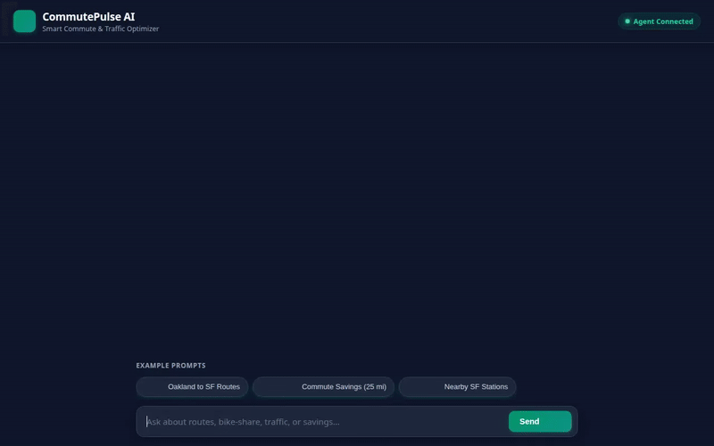

# CommutePulse AI — Smart Commute & Traffic Optimizer

> A conversational AI agent built with Google's Agent Development Kit (ADK) that helps urban commuters optimize transit routes, calculate financial and CO2 savings, check real-time micro-mobility availability, and render rich visual commute cards.



---

## Capabilities & Implemented Tools

CommutePulse AI implements the following production features and Google Cloud integrations:

### 🧠 Vertex AI Memory Bank Integration
- **Persistent Commuter Memory**: Uses `PreloadMemoryTool` and `generate_memories_callback` (`after_agent_callback`) to store and recall commuter home/work locations, vehicle preferences, allergies, and health restrictions across conversations.

### 🗄️ Google Cloud Firestore Database
- **`list_transit_routes`**: Searches and filters stored Bay Area transit options (Express Bus, BART, Ferry, Carpool) from Firestore.
- **`add_transit_route`**: Persists new transit corridor options, travel durations, costs, and traffic status to Firestore.

### 🖼️ Multimodal Generation (Gemini Models)
- **`generate_commute_image`**: Generates visual route maps, traffic overviews, and eco-achievement badges using `gemini-3.1-flash-lite-image`.
- **`generate_commute_video`**: Creates short animated simulations of transit modes using `gemini-omni-flash-preview`.

### 🪣 Google Cloud Storage
- **Public Asset Hosting**: Uploads generated images (`images/`) and video bytes (`videos/`) directly to a public Cloud Storage bucket to return public HTTPS media URLs.

### 🌐 Real-Time APIs & Geocoding
- **`fetch_bikeshare_stations`**: Connects to the public CityBikes API to fetch live bike and dock availability for Bay Area Bay Wheels stations.
- **`geocode_address`**: Converts street addresses to exact latitude/longitude coordinates via Google Maps Geocoding API.
- **`search_nearby_places`**: Discovers nearby transit hubs and stations using the Google Places API (New).

### 💻 Code Sandbox & Analytics
- **`calculate_commute_savings`**: Computes monthly fuel, toll, and parking savings alongside carbon emission reductions.
- **`AgentEngineSandboxCodeExecutor`**: Executes Python code in a secure sandboxed environment for custom math and data calculations.

### 🎨 A2UI (Agent-to-User Interface v0.8)
- **Structured Dynamic Cards**: Renders clean A2UI component cards (Card, Column, Row, Text, Image) for transit routes, savings summaries, and map imagery using `A2uiSchemaManager` and `a2ui_callback`.

---

## Planned / Future Enhancements

The following features described in early design briefs are currently **planned, not yet implemented**:
- **`match_carpool_buddies`**: Matching commuters traveling along shared corridors.
- **`get_traffic_incidents`**: Real-time road closure and incident alerts.

---

## Project Structure

```
commutepulse-ai/
├── app/
│   ├── agent.py          # Root agent, tools, Memory Bank, Firestore & A2UI setup
│   ├── a2ui_utils.py     # A2UI callback formatting helper
│   └── __init__.py
├── frontend/
│   ├── main.py           # FastAPI A2A proxy server
│   ├── requirements.txt  # Frontend dependencies
│   └── static/
│       ├── index.html    # CommutePulse AI web interface
│       └── style.css     # Dark-mode transit styling
├── agents-cli-manifest.yaml
├── deployment_metadata.json
├── demo.gif              # Inline demonstration recording
└── README.md
```

---

## Setup & Local Execution

### Prerequisites

- Python 3.10+
- Google Cloud Project with Firestore, Vertex AI, and Cloud Storage enabled
- `GOOGLE_MAPS_API_KEY` set in environment or `.env`

### Running the Agent & Frontend Locally

1. **Install Dependencies**:
   ```bash
   pip install -r requirements.txt
   pip install -r frontend/requirements.txt
   ```

2. **Start the Frontend Proxy Server**:
   ```bash
   cd frontend
   export AGENT_DIRECTORY="app"
   python main.py
   ```

3. **Access the Web Interface**:
   Start a browser and navigate to port `8080` on your local server.
